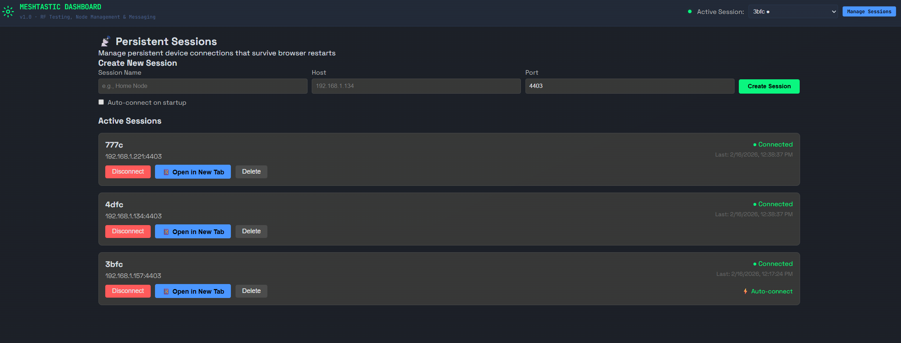
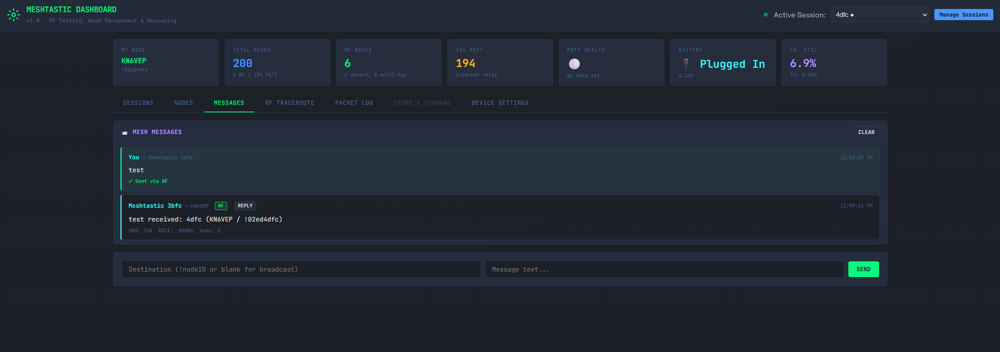
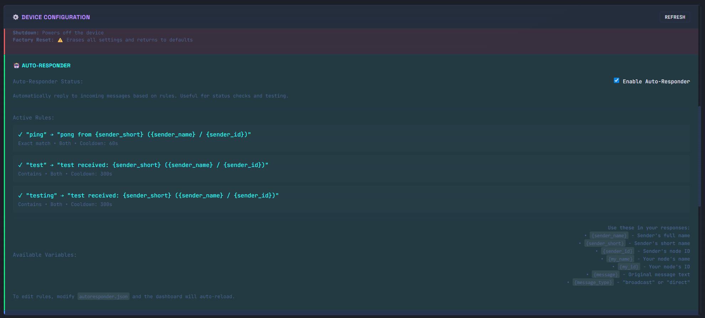
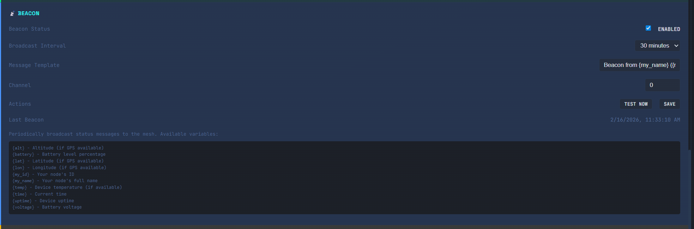
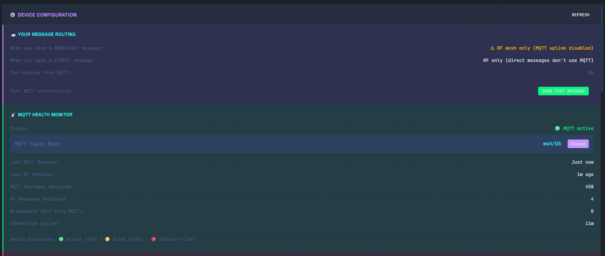

# Meshtastic Dashboard

A powerful web-based control panel for managing Meshtastic nodes with advanced features for testing, monitoring, and automation.

**GitHub:** https://github.com/lordachoo/meshtastic-control


*Multi-session interface showing connection management and active sessions*

Connects to your Meshtastic device over TCP (WiFi) and provides:

- **Multi-User Support** — Session-based architecture allows multiple users to connect to different devices simultaneously
- **Node Overview** — See all nodes in your mesh with filtering (RF-only, MQTT, nearby)
- **RF Traceroute** — Test signal reach to individual nodes and see the hop path
- **RF Sweep** — Automated traceroute to all RF-reachable nodes to map your coverage
- **Live Packet Log** — Watch packets flowing through the mesh in real-time
- **Messaging** — Send broadcast or direct messages with reply buttons
- **Auto-Responder** — Automated responses to incoming messages (ping/pong, test triggers)
- **Beacon System** — Periodic status broadcasts with battery, uptime, GPS data
- **Connection History** — Save and quickly switch between multiple devices
- **Device Configuration** — View and manage device settings, channels, and modules
- **MQTT Health Monitoring** — Track MQTT vs RF message ratios

## Requirements

- Python 3.8+
- SQLite3 (included with Python)
- A Meshtastic device with WiFi enabled and network API accessible (TCP port 4403)
- Modern web browser (Chrome, Firefox, Safari, Edge)

## Setup

```bash
# Install dependencies
pip install meshtastic flask pypubsub protobuf

# Run the single-user dashboard
python app.py

# OR run the multi-user version (recommended)
python app_multiuser.py
```

Then open **http://localhost:5000** in your browser.

### Multi-User vs Single-User

- **`app.py`** - Original single-user version. One global connection, simple architecture.
- **`app_multiuser.py`** - Session-based multi-user version. Each browser session can connect to a different device independently.

For testing with multiple devices, use `app_multiuser.py` and open:
- Normal browser window for Device 1
- Incognito/Private window for Device 2
- Different browser for Device 3, etc.

Each session maintains its own connection, packet log, and state.

## Usage

### Quick Start

1. Enter your Meshtastic node's IP address (e.g., `192.168.1.134`) and click **Connect**
2. Save the connection using the 💾 button for quick access later
3. The dashboard will pull your node database and display all known nodes


*Main dashboard showing node list, messages, and device statistics*

### Tabs Overview

**Nodes Tab**
- Browse all nodes in your mesh
- Filter by RF/MQTT/Nearby
- Click node names to send messages or traceroutes
- See signal strength, distance, and hop count
- **RESET NODEDB** button to clear device's node database (requires disconnect/reconnect)

**Messages Tab**
- View all text messages (incoming and outgoing)
- Reply button for quick responses
- Send broadcast or direct messages
- Shows MQTT vs RF source indicators

**RF Traceroute Tab**
- Test signal reach to specific nodes
- See hop-by-hop path and SNR data
- Run automated RF Sweep to test all nodes
- Quick-select buttons for nearby nodes

**Packet Log Tab**
- Real-time view of all packet types
- Filter by message type
- Reply buttons on text messages
- Shows technical details (SNR, RSSI, hops)

**Device Settings Tab**
- View device configuration
- Configure MQTT bridge
- Manage auto-responder rules
- Set up beacon broadcasts
- Configure message filters

## Node Filters

| Filter | Description |
|--------|-------------|
| **All** | Every node your device knows about |
| **RF Only** | Nodes heard directly over LoRa (not via MQTT internet relay) |
| **MQTT** | Nodes only reachable via the MQTT internet bridge |
| **Nearby** | Non-MQTT nodes within 2 hops |

## RF Sweep

The sweep feature automatically sends traceroutes to all non-MQTT nodes (and any MQTT nodes within 2 hops). Each node gets a 30-second timeout, with a 3-second delay between tests to avoid overwhelming the mesh. Results show:

- **Complete** — Node responded with route path and SNR data
- **Timeout** — Node did not respond within 30 seconds
- **Error** — Something went wrong sending the traceroute

## Advanced Features

### Auto-Responder System


*Auto-responder rule configuration interface*

The auto-responder automatically replies to incoming messages based on configurable rules.

**How It Works:**
1. Every incoming TEXT_MESSAGE_APP packet is checked against active rules
2. Rules support three trigger types:
   - **Exact** - Message must exactly match trigger (case-insensitive)
   - **Contains** - Message must contain trigger text anywhere (case-insensitive, matches substrings)
   - **Starts With** - Message must start with trigger text (case-insensitive)
3. Each rule has a cooldown period to prevent spam (default: 60-300 seconds)
4. Responses support variable substitution: `{sender_name}`, `{sender_short}`, `{sender_id}`, `{my_name}`, `{my_id}`, `{message}`, `{message_type}`
5. Rules can be filtered by message type (broadcast, direct, or both)
6. The system prevents responding to:
   - Your own messages
   - Messages from unknown/invalid senders (None, ?, empty)
   - Empty messages

**Configuration:**
- Edit `autoresponder.json` or use the Device Settings tab
- Default rules: "ping" → "pong", "test"/"testing" → acknowledgment
- Rules are global across all sessions

**Example Rule:**
```json
{
  "id": "ping",
  "enabled": true,
  "trigger": "ping",
  "triggerType": "exact",
  "response": "pong from {sender_short} ({sender_name} / {sender_id})",
  "messageType": "both",
  "cooldownSeconds": 60
}
```

### Beacon System


*Beacon system configuration with message templates and scheduling*

The beacon system broadcasts periodic status messages with live device telemetry.

**How It Works:**
1. Background thread runs per session when beacon is enabled
2. Thread sleeps for configured interval (5min - 24hr)
3. On wake, retrieves current device metrics from Meshtastic API
4. Substitutes variables in message template
5. Broadcasts message to mesh on configured channel
6. Adds message to packet log for visibility
7. Updates `last_beacon_time` in config
8. Repeats until disabled or session ends

**Scheduling:**
- Uses Python threading with daemon threads
- Sleeps in 1-second chunks to allow quick shutdown
- Automatically stops when:
  - Beacon is disabled
  - Session disconnects
  - Interface is closed
  - Session times out

**Available Variables:**
- `{my_name}` - Your node's full name
- `{my_id}` - Your node ID (e.g., !02ed4dfc)
- `{battery}` - Battery level percentage
- `{voltage}` - Battery voltage
- `{uptime}` - Device uptime (e.g., 5h23m)
- `{time}` - Current time (HH:MM:SS)
- `{lat}`, `{lon}`, `{alt}` - GPS coordinates (if available)
- `{temp}` - Device temperature (if available)

**Configuration:**
- Edit `beacon.json` or use Device Settings tab
- Set interval, message template, and channel
- Test beacon sends immediately without waiting
- Beacon config is global but each session runs its own thread

**Example Template:**
```
Beacon from {my_name} ({my_id}) | Battery: {battery}% | Uptime: {uptime} | Time: {time}
```

### Message Routing & MQTT Health


*Message routing configuration and MQTT health statistics*

### Connection History

Save frequently-used device connections for quick access.

**How It Works:**
1. Connections stored in browser localStorage (per-browser, persistent)
2. Click 💾 button to save current host:port
3. Optionally name the connection (e.g., "Home Node", "Mobile Device")
4. Select from dropdown to instantly populate connection fields
5. Each browser (normal/incognito) has independent storage

**Use Cases:**
- Quickly switch between multiple devices
- Save home, mobile, and remote nodes
- Different connections in normal vs incognito for multi-device testing

### Session Management (Multi-User)

**Architecture:**
- Each browser session gets a unique session ID (Flask cookie)
- Session data includes: interface, packet log, traceroute results, sweep status, MQTT health
- Sessions timeout after 1 hour of inactivity
- Maximum 10 concurrent sessions (configurable)
- Automatic cleanup of idle sessions

**Packet Routing:**
- Single global `pubsub` subscription for all sessions
- Each interface object tagged with `_session_id` attribute
- `on_receive` callback routes packets to correct session based on interface ID
- Session-isolated packet logs, traceroute results, and state

**Thread Safety:**
- Global `sessions_lock` protects session dictionary
- Beacon threads are per-session, daemon threads
- Auto-responder uses global cooldown tracking

## Notes

- Your Meshtastic device must have WiFi enabled and be on the same network
- The default TCP API port is 4403
- The dashboard runs on port 5000 by default
- In single-user mode (`app.py`), only one client should connect at a time
- In multi-user mode (`app_multiuser.py`), each session connects independently
- RF Sweep can take a long time if you have many non-MQTT nodes — each gets up to 30 seconds
- Auto-responder and beacon configs are shared across all sessions
- Connection history is per-browser (localStorage)

## Troubleshooting MQTT with mosquitto_sub

You can use the `mosquitto_sub` command-line client to monitor MQTT traffic directly and troubleshoot connectivity issues. This is useful for:

- Verifying your device is publishing to MQTT
- Seeing your own messages and responses
- Testing different topic subscriptions
- Debugging auto-responder behavior

### Installation

**Linux/macOS:**
```bash
# Ubuntu/Debian
sudo apt-get install mosquitto-clients

# macOS
brew install mosquitto
```

**Windows:**
Download from [mosquitto.org](https://mosquitto.org/download/) or use WSL2.

### Basic Usage

Monitor all traffic for your region:
```bash
mosquitto_sub -h mqtt.meshtastic.org -u meshdev -P large4cats -t "msh/US/#" -v -i YOUR_CALLSIGN_monitor
```

Monitor specific state (e.g., California):
```bash
mosquitto_sub -h mqtt.meshtastic.org -u meshdev -P large4cats -t "msh/US/CA/#" -v -i YOUR_CALLSIGN_monitor
```

Monitor only your node's traffic:
```bash
mosquitto_sub -h mqtt.meshtastic.org -u meshdev -P large4cats -t "msh/2/e/!YOUR_NODE_ID/#" -v -i YOUR_CALLSIGN_monitor
```

### Command Options

| Option | Description |
|--------|-------------|
| `-h` | MQTT broker hostname |
| `-u` | Username (default: `meshdev`) |
| `-P` | Password (default: `large4cats`) |
| `-t` | Topic to subscribe to (use `#` wildcard for all subtopics) |
| `-v` | Verbose mode (shows topic name with each message) |
| `-i` | Client ID (use your callsign + `_monitor` to avoid conflicts) |

### Example Output

```
msh/US/CA/2/e/LongFast/!02ed4dfc {"from":34680060,"to":4294967295,"channel":0,"type":"text","payload":"test"}
msh/US/CA/2/e/LongFast/!040944e0 {"from":67634400,"to":4294967295,"channel":0,"type":"position","latitude":37.7749,"longitude":-122.4194}
```

### Tips

- **Use `-v` flag** to see which topic each message came from
- **Set unique client ID** with `-i` to avoid disconnections (use your callsign)
- **Start with narrow topics** like your state or node ID to reduce noise
- **Test auto-responder** by sending "ping" or "test" and watching for replies
- **Monitor while using dashboard** to see both sides of the conversation

### Common Topics

| Topic Pattern | What You'll See |
|---------------|-----------------|
| `msh/US/#` | All US traffic (very high volume) |
| `msh/US/CA/#` | California only |
| `msh/2/e/LongFast/#` | Default encrypted channel (all regions) |
| `msh/2/e/!YOUR_NODE_ID/#` | Only your node's messages |
| `msh/2/c/#` | Unencrypted messages only |

## Architecture

### Single-User (`app.py`)
```
Browser  <-->  Flask (port 5000)  <-->  Meshtastic Python API  <-->  Your Node (TCP:4403)
```
Single Python process, no database needed. All state is held in memory.

### Multi-User (`app_multiuser.py`)
```
Browser 1 (Session A)  ──┐
Browser 2 (Session B)  ──┼──>  Flask (port 5000)  ──>  Session Manager
Browser 3 (Session C)  ──┘                                    │
                                                               ├──> Interface A  ──>  Node A (TCP:4403)
                                                               ├──> Interface B  ──>  Node B (TCP:4403)
                                                               └──> Interface C  ──>  Node C (TCP:4403)
```

**Session Isolation:**
- Each session maintains independent: connection, packet log, traceroute results, sweep state
- Global pubsub subscription routes packets to correct session via interface tagging
- Beacon threads run per-session with independent scheduling
- Auto-responder rules are global but cooldowns prevent cross-session interference

## NodeDB Management

The **RESET NODEDB** button in the Nodes tab allows you to clear your device's internal node database. This is useful when:

- Node data is stale or incorrect (e.g., wrong signal metrics from multi-hop packets)
- You want to start fresh and rebuild the node list
- Testing node discovery behavior

**What happens:**
1. Clears all node entries from the device's nodeDB
2. Device reboots automatically
3. **You must DISCONNECT and RECONNECT the session** after reset
4. Node database rebuilds automatically as packets are received

**What's preserved:**
- Your device settings, channels, and configuration
- Message history in the dashboard database

**What's lost:**
- All cached node info (names, positions, last heard times)
- Signal metrics (SNR/RSSI) for all nodes

The device will repopulate the nodeDB over the next few minutes/hours as it hears packets from other nodes.

## Configuration Files

- `autoresponder.json` - Auto-responder rules and settings (gitignored)
- `beacon.json` - Beacon configuration and variable definitions (gitignored)
- `message_filter.json` - Message filtering rules (gitignored)
- `messages.db` - SQLite database for persistent message storage (gitignored)
- `persistent_sessions.json` - Saved session configurations (gitignored)
- `debug.log` - Debug logging output when DEBUG=true (gitignored)

## Message Persistence

Text messages are automatically saved to a SQLite database (`messages.db`) for persistence across browser sessions and app restarts. Only TEXT_MESSAGE_APP packets (actual messages) are stored - other packet types (position, telemetry, nodeinfo) are kept in memory only.

**View Messages from Command Line:**

```bash
# List all sessions with message counts
./view_messages.sh

# View messages for a specific session (last 50)
./view_messages.sh 3bfc

# View more messages
./view_messages.sh 3bfc 100
```

The database stores:
- Incoming text messages (RF and MQTT)
- Outgoing messages sent via UI
- Auto-responder replies
- Beacon broadcasts

Messages are automatically loaded when you reconnect to a session, providing full message history.

## Documentation

- `MULTIUSER_GUIDE.md` - Detailed multi-user architecture and refactoring guide
- `MULTIUSER_TESTING.md` - Testing procedures for multi-user functionality
- `MULTIUSER_COMPLETE.md` - Summary of multi-user refactoring changes
- `MQTT_CHANNELS.md` - MQTT topic structure and channel information

## Contributing

Pull requests welcome! Please test both single-user and multi-user modes.

## License

MIT License - See repository for details
